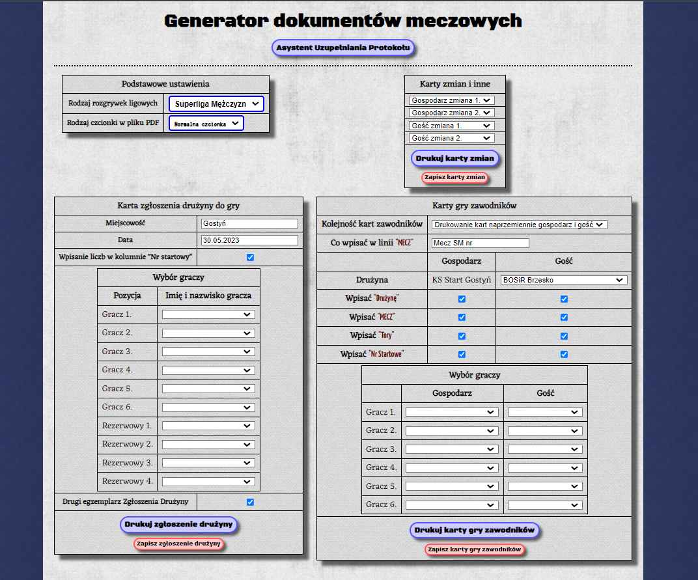
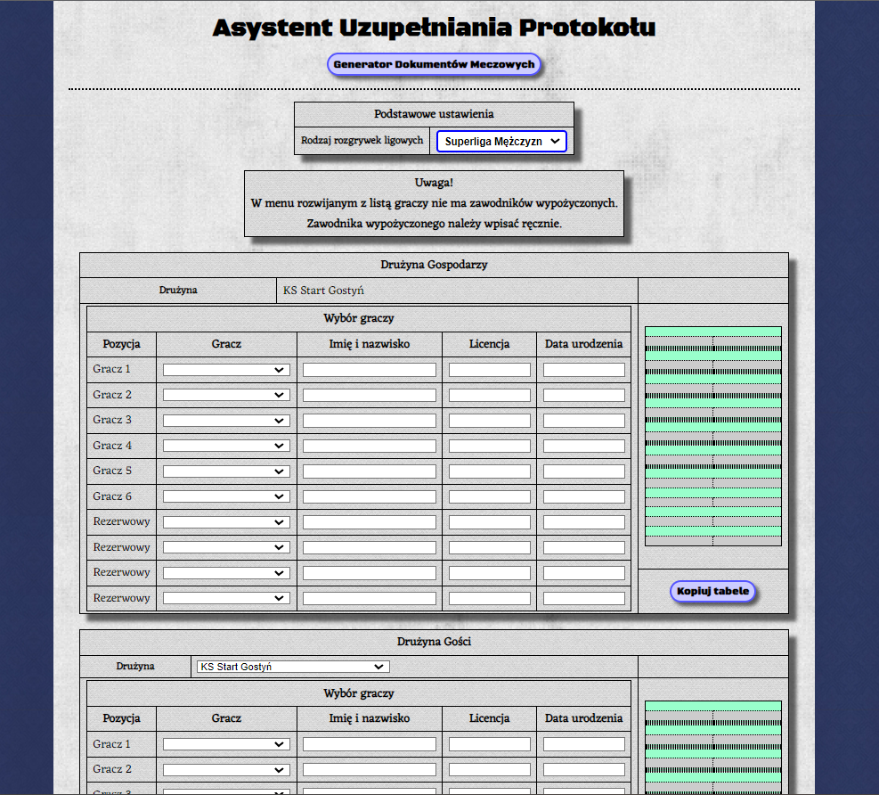

# Strona pomagająca w uzupełnianiu dokumentów meczowych w kręglach klasycznych

## O projekcie
Strona pomaga wypełnić niezbędne dokumenty potrzebne przed meczem oraz (https://start.ct8.pl/) i umożliwia potem ich wydrukowanie. Oraz jest również podstrona, która pomaga uzupełnić internetowy protoków meczowy (https://start.ct8.pl/aup.html)

## Wygląd
1.  

2.
